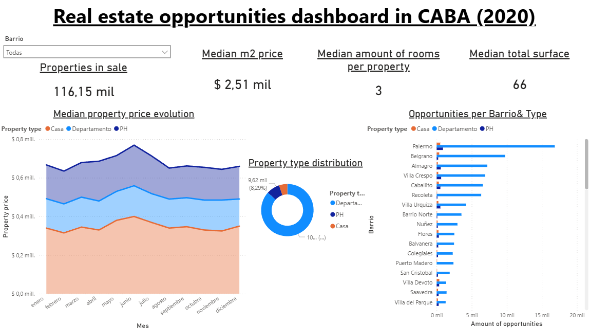

# Real Estate Dashboard — CABA (2020)

Power BI dashboard to explore **properties for sale in Ciudad Autónoma de Buenos Aires (CABA), Argentina**, focused on the **2020** listings snapshot. The report helps identify “opportunities” by comparing neighborhoods (*barrios*) and property types (Departamento / Casa / PH) across price and surface-area metrics.

## Dashboard preview

## What’s inside

- **Interactive filters**: barrio selector (and other slicers inside the report).
- **Cards / KPIs**: median price per m², median rooms, median covered m² (as defined in the model).
- **Breakdowns**:
  - property type distribution (Casa / PH / Departamento)
  - properties for sale by barrio and type
  - historical trend of median price by type vs. publication date (where we can see how the different properties affect the composition)

## Data source

The base dataset comes from the Buenos Aires housing dataset used in this Kaggle notebook:

- `https://www.kaggle.com/code/msorondo/a-housing-price-predictor-for-buenos-aires-c#notebook-container`

In this repo, raw data is stored under `data/raw_data/`.

## Data preparation (high-level)

Most of the transformation logic lives in the Power BI model (Power Query). The overall cleaning/feature-engineering approach:

- Filter to **CABA** listings that include neighborhood (*barrio*) information (reduced from ~2M rows to ~117k).
- Keep only **for-sale** listings.
- Keep only **Casa / PH / Departamento**.
- Drop columns that add little value to the dashboard (while keeping `lat`, `lon`, `title`, `description` for locating/understanding listings).
- Normalize/rename key fields (e.g., publication and sale dates, location levels).
- Impute / standardize:
  - rooms and bedrooms (including monoambientes edge cases)
  - bathrooms for monoambientes
  - missing prices (estimated using neighborhood median price per m² and size/rooms heuristics)
  - currency normalization to USD
  - total surface area when exterior space info is missing (fallback to covered surface)

Resulting quality improvements (as measured during prep):

- `rooms`: ~7% null → <1%
- `bedrooms`: ~23% null → <1%
- `bathrooms`: ~7% null → ~4%
- `price`: ~2% missing → <1%

## How to use

### Requirements

- **Power BI Desktop** (Windows)

### Open the report

1. Download/clone this repository.
2. Open `real_state_dashboard_CABA.pbix` with Power BI Desktop.
3. If prompted, update data source paths so Power BI can find the CSV under `data/raw_data/`.
4. Click **Refresh** to rebuild the model and visuals (first refresh can take a while due to dataset size).

## Project structure

- `real_state_dashboard_CABA.pbix`: the Power BI report (data model + Power Query + visuals)
- `dashboard_p1.png`, `dashboard_p2.png`: preview screenshots
- `data/raw_data/`: raw dataset inputs 

## Credits

- Dataset reference: Kaggle notebook linked above.
